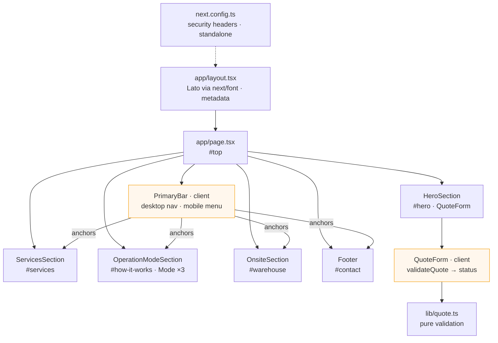
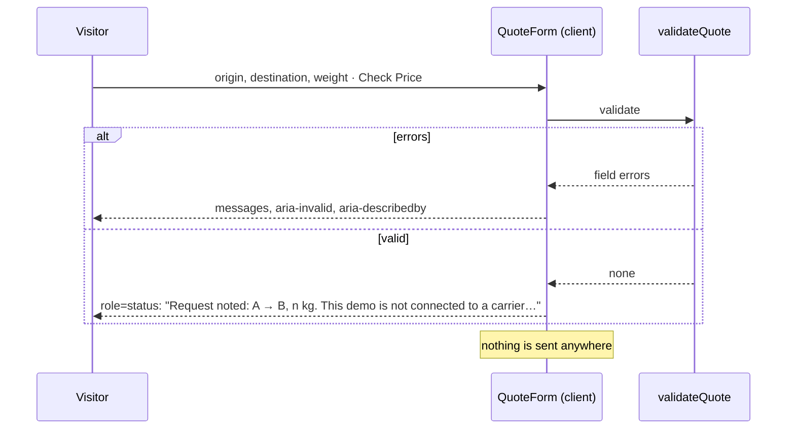

# ShipUp — logistics landing page

[](https://github.com/daniellopez882/ShipUps/actions/workflows/ci.yml)


A single-page marketing site for a warehousing, freight and packaging
service: hero with a quote form, services, a three-step "how it works",
a warehouse locations panel and a footer. Next.js 15 (App Router),
React 19, Tailwind, shadcn-style `Button`/`Input`.

> **What it is.** A landing page. The previous README also called it "a modern
> SaaS platform … with powerful features to streamline shipping workflows";
> there is no application behind the page, and the quote form says so when
> you submit it. Live demo (Vercel): <https://ship-ups.vercel.app/>.

## At a glance

| | |
|---|---|
| **Is** | A static Next.js page: five sections, one client-side form, one mobile menu |
| **Controls** | Every navigation item links to a section that exists; every call to action leads to the quote form; the one control with nothing behind it (Play Demo) is disabled and says so |
| **Tests** | 13 — the page renders with `console.error`/`warn` spied (fails on the old `layout="fill"` warning), every image is described or decorative, nav targets exist, the mobile menu, the quote form's validation |
| **CI** | `next lint` · `tsc` · vitest · build · a grep that the body font is actually in the built CSS · `npm audit --audit-level=high` · gitleaks · container: non-root standalone server, page served, CSP and frame headers |

## How it fits together



### The quote form



## Getting started

```bash
npm ci
npm run dev          # http://localhost:3000
npm test             # vitest
npm run lint && npm run typecheck && npm run build
```

### Container

```bash
docker build -t shipups .
docker run --rm -p 3000:3000 shipups     # standalone server, uid 10001
```

## What changed, and why

| # | Defect | Effect |
|--:|---|---|
| 1 | Body font never loaded: `@fontsource/lato` never imported; the `next/font` call sat in a Pages-router `_app.js` inside the App Router; `globals.css` set Arial | The design's `font-lato` rendered in Arial; the built CSS contained no Lato ([ADR 0002](docs/adr/0002-app-router-fonts-and-images.md)) |
| 2 | `next/image` with `layout="fill"`, removed in Next 13 | A warning on every render; images depending on a prop that no longer sizes them |
| 3 | Alt text `"100"`, `"/track.png"`, `"/mode1.jpg"` | Meaningless to screen readers; now described from the images, or `alt=""` where decorative |
| 4 | Six nav items were `<div>`s; four named sections that do not exist; the burger did nothing | No navigation at all on mobile; fake menus on desktop ([ADR 0001](docs/adr/0001-controls-do-what-they-say.md)) |
| 5 | Five CTA buttons had no handler or href; three inputs with no `<form>` | Nothing on the page could be used |
| 6 | README: "a modern SaaS platform … streamline shipping workflows" | It is a landing page |
| 7 | `npm audit`: high advisories against the pinned `next@15.1.2` | Next updated within 15.x; the audit is in CI |
| 8 | `next.config.ts` empty; no security headers | CSP, frame, content-type, referrer and permissions headers on every route |
| 9 | `tailwind.config.ts` used `mode: "jit"` (not a Tailwind 3 option) and scanned `src/pages/**`, which does not exist; `lucide-react` depended on and never used | Dead configuration and a dead dependency |
| 10 | "Shopify, , or any other platform" | A typo in the copy |
| 11 | No tests, no CI, no container | Nothing checked anything |

## Design notes

| Record | Decision |
|---|---|
| [ADR 0001](docs/adr/0001-controls-do-what-they-say.md) | Controls do what they say; the form validates and states what it does |
| [ADR 0002](docs/adr/0002-app-router-fonts-and-images.md) | One router, one font mechanism, current image props |
| [Threat model](docs/threat-model.md) | Headers, framework advisories, container user; nothing collected |

## Layout

```
src/app/            layout.tsx (font, metadata) · page.tsx · globals.css
src/components/
  sections/         Hero · Services · OperationMode · Onsite · Footer
  small/            PrimaryBar (client) · QuoteForm (client) · NavItem · buttons · Mode · Service · Subtitle
  ui/               shadcn Button, Input
src/lib/            quote.ts (validation) · utils.ts
src/test/           vitest setup
docs/               ADRs, threat model
next.config.ts · Dockerfile · .github/workflows/ci.yml
```

## Limits

- A landing page with a validated form; there is no backend to send the
  request to.
- `mode3.jpg` is the same illustration as the hero image.

## Licence

MIT — see [LICENSE](LICENSE).
